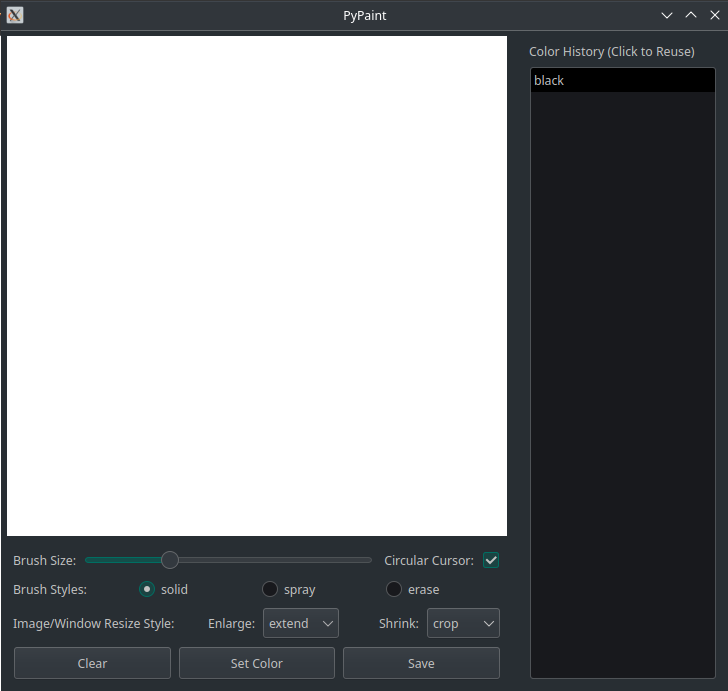

# PyPaint



## Description

A painting GUI with the following functionalities and widgets:
* **Label Widget (QLabel)**
* **Slider Widget (QSlider):** Change Brush Size
* **Checkbox Widget (QCheckBox):** Toggle Circular Drawing Cursor
* **Radio Widget (QRadioButton):** Change Brush Style (Solid, Spray, Erase)
* **ComboBox Widget (QComboBox):** Image/WIndow Resize Style
  * Enlarge (extend, scale)
  * Shrink (crop, scale)
* **Button (QPushButton):** Clear Canvas, Change Brush Color, Save Canvas as png
* **Color, MessageBox, File Widget (QColorDialog, QMessageBox, QFileDialog)**
* **List Widget (QListWidget, QListWidgetItem):** Color History

### Dependencies

* PyQt5
* random

### Executing program

How to run the program
```
python main.py
```
## Classes & Functions
* **PyPaintMainUi:** Encapsulates PaintWidget, Settings, and Color History
  * `_addWidgets(self)`: encapsulates PaintWidget, Settings, and Color History under a central widget
* **PaintWidget:** Encapsulates canvas and painting functionalities
  * `updateCustomCursor(self)`: updates drawing cursor (circle with currently selected color if the brush style is not spray; otherwise, sets the cursor to be a pointer cursor)
  * `mousePressEvent(self, event)`: mouse press event handler to draw first point
  * `mouseMoveEvent(self, event)`: mouse move event handler to draw continuous points along drawn path
  * `mouseReleaseEvent(self, event)`: mouse release event handler to reset current cursor position
  * `setShowCursor(self, val)`: toggles whether the circular cursor can be seen
  * `setColor(self, color)`: sets brush color
  * `setBrushSize(self, size)`: sets brush size
  * `setStyle(self, style)`: sets brush style
  * `setEnlargeStyle(self, style)`: sets enlarge style
  * `setShrinkStyle(self, style)`: sets shrink style
  * `changeColor(self)`: retrieves selected color from color dialog, sets bursh color, and returns color
  * `clearImage(self)`: "clears" canvas by filling canvas with white
  * `clearImageDialog(self)`: message dialog to clear canvas
  * `saveImage(self)`: message dialog to save image as a png
  * `extend(self)`: adds empty canvas space/removes canvas space
  * `scale(self)`: stretches/shrinks canvas to new canvas size
  * `resizeEvent(self, event)`: canvas resize to handle enalarge styles (extend & scale) and shrink (extend & scale) styles
* **Settings:** Encapsulates brush size, cursor, brush styles, image/window resize, clear, colors, and save settings
  * `_addWidgets(self)`
  * `_linkActions(self)`
  * `changeColor(self)`
  * `setStyle(self)`
* **ColorHistory:** Encapsulates color history list and reuse color functionalities
  * `_addWidgets(self)`
  * `_linkActions(self)`
  * `_reuseColor(self, color)`
  * `addColor(self, color)`

## Authors

Contributors names
[@Adeebur Rahman](https://github.com/adeeburrahman)
[@Darren Liang](https://github.com/dliang2)
[@Emily Fang](https://github.com/ef1301)